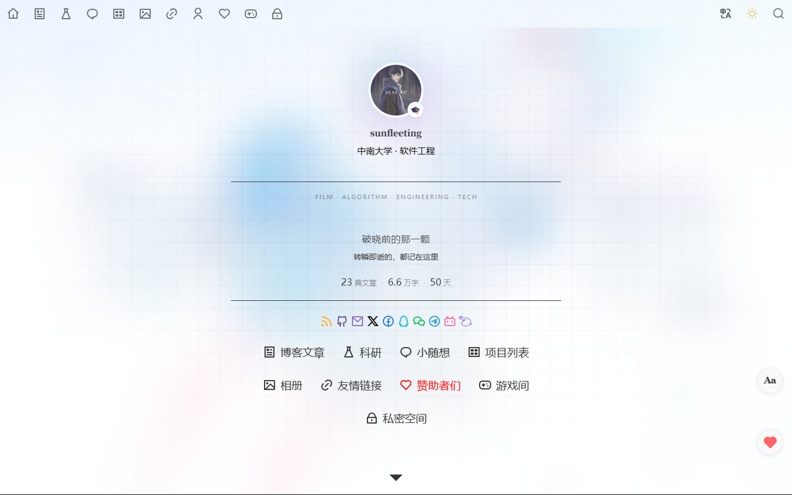
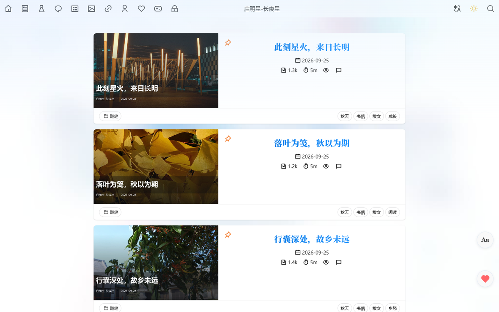
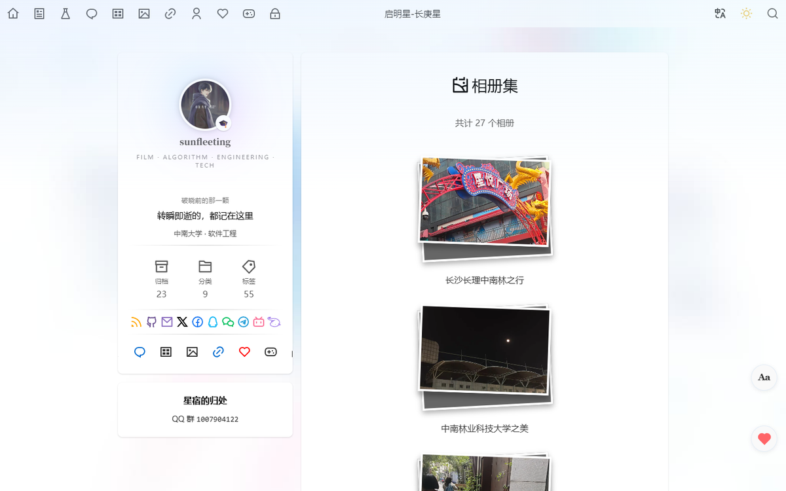
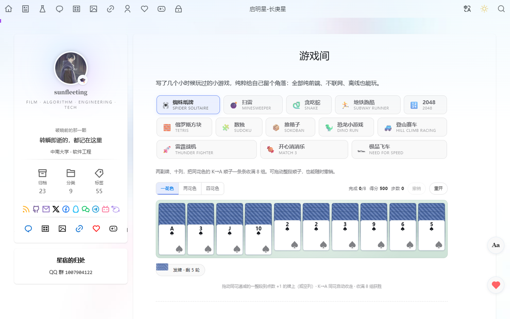
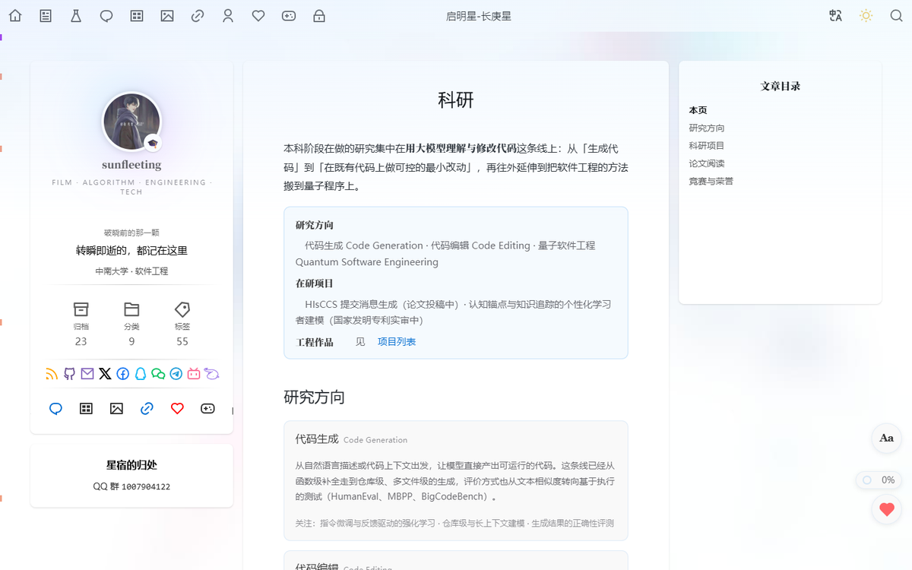
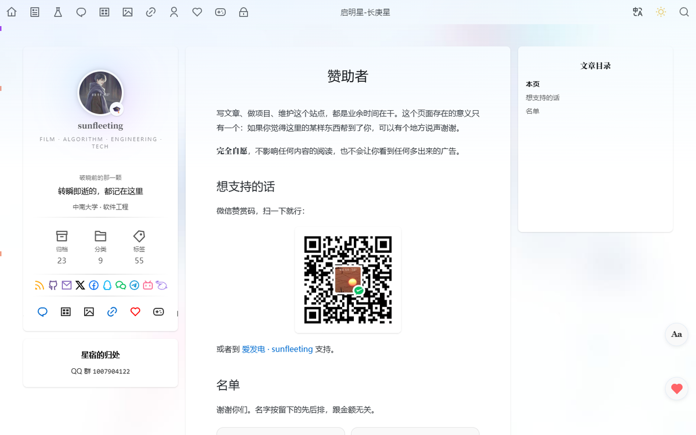
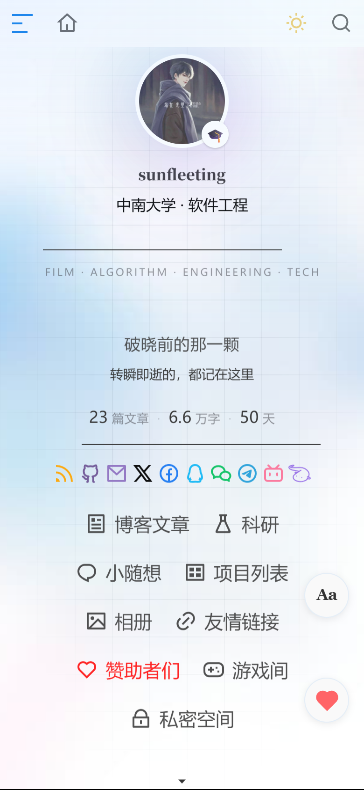

<div align="center">
  
  <h1>启明星-长庚星</h1>
  <p><b>sunfleeting 的个人博客</b><br /><sub>破晓前的那一颗 · 转瞬即逝的，都记在这里</sub></p>
  <p>
    <a href="https://sunfleeting-debug.github.io/"></a>
    
    
    
    
  </p>
  <p>
    <a href="README.md">简体中文</a> ·
    <a href="README.en.md">English</a>
  </p>
</div>

<p align="center">
  
</p>

写代码、读闲书、偶尔出门拍点东西。这个站是给这些东西找的一个落脚处 —— 不追流量，也不打算做成「内容矩阵」，就是一块自己说了算的地方。

站点是**纯静态**的：没有后端、没有数据库、没有追踪脚本，所有页面在构建时就渲染好。想看一眼的话，直接打开 **[sunfleeting-debug.github.io](https://sunfleeting-debug.github.io/)**。

> **关于这个仓库**：这里是**构建产物仓库**（GitHub Pages 直接发布它），站点的源工程（Valaxy 项目）在本地工作区维护，暂未开源。所以你会看到根目录是一堆 `*.html` 而不是 `pages/*.md` —— 这不是手写的，是构建出来的。README 与配图是本仓库里唯一「手工维护」的部分。

---

## 一览

| | |
| --- | --- |
| **站点** | [sunfleeting-debug.github.io](https://sunfleeting-debug.github.io/) |
| **框架** | [Valaxy](https://github.com/YunYouJun/valaxy) `1.0.0-rc.15` · Vue 3 · Vite SSG |
| **主题** | [`valaxy-theme-yun`](https://github.com/YunYouJun/valaxy-theme-yun)（在此基础上重写了 36 个自定义组件） |
| **托管** | GitHub Pages（`main` 分支 / 根目录，固定二级域名） |
| **内容**（截至 2026-10） | 文章 23 篇 · 分类 9 个 · 标签 51 个 · 相册 27 本（916 张）· 随想 5 条 · 自研小游戏 13 款 |
| **形态** | 纯静态 · 无后端 · 无数据库 · 无统计脚本 |

---

## ✨ 特性

### 📝 写作与阅读

- **文章 / 归档 / 分类 / 标签**：从 `微读` 到 `论文` 都有，标签体系按主题而非按时间组织。
- **阅读体验**：毛玻璃导航栏、右缘阅读进度、右侧文章目录、代码块高亮与复制、图片灯箱。
- **阅读字体切换**：右下角一键在 **默认 / 宋体 / 楷体** 三套中文字体栈之间切换，选择持久化并做了首屏反闪烁处理。
- **中文排版**：正文按中文习惯重排 —— 段距放宽、标题字重封顶 500（CJK 不用 bold 压标题）、引号与标点归一。微信公众号迁移过来的文章刻意保留原文视觉，不套用这套排版。

### 🖼 相册

- **27 本相册、916 张照片**：按出行分组，自建 `layout: album` + `PhotoAlbum.vue`，不走主题自带的 gallery。
- **两档图源**：列表用缩略图、点开加载原图，避免一次拉满。
- **大图浏览**：键盘左右切换、循环翻页、点背景关闭。

### 🎮 游戏间

- **13 款纯前端小游戏**：蜘蛛纸牌、扫雷、贪吃蛇、地铁跑酷、2048、俄罗斯方块、数独、推箱子、恐龙小游戏、登山赛车、雷霆战机、开心消消乐、极品飞车。
- **离线可玩**、不联网、不上传成绩；最高分落在浏览器本地。
- 登山赛车的物理单独抽成 `hillclimb-physics.mjs`，用 Node 无头复算参数。

### 🔬 科研与项目

- **`/research`**：用大模型理解与修改代码这条线上的研究方向、在研项目与论文阅读记录。
- **`/projects`**：课程与个人项目的清单，带仓库链接。

### 🔐 私密空间（客户端加密）

站上有一部分内容不想公开，但站点又是纯静态的 —— 于是把**加密放在浏览器里**：

- 正文与图片在写入仓库前就用 **AES-256-GCM** 加密，密钥由口令经 **PBKDF2-SHA256（310,000 次迭代）**在本地派生。
- 仓库与线上**只有密文**：文件名随机化，清单本身也是加密的，口令不写进任何产物。
- 解密全部在浏览器内完成，密钥不出本机；不输对口令的话，页面里连一张图片都拿不到。
- 需要说明的是：**加密强度上限等于口令强度**。这类空间的定位是「挡住随手点开的人」，不是对抗针对性的离线爆破。

### 🎨 其它细节

- **首页导览条**：进站先看到「写什么 / 我在做什么 / 精选」三块，而不是一堵文章列表。
- **文章置顶**：主题原生 `top` 字段，值越大越靠前。
- **赞助者页**：名单是一张卡片墙，头像本地自托管，不热链第三方。
- **全站无追踪**：没有统计脚本、没有广告、没有第三方 cookie。

---

## 📸 界面

<div align="center">
<table>
  <tr>
    <td width="50%" align="center"><br><sub>首页 —— 导览条与精选</sub></td>
    <td width="50%" align="center"><br><sub>文章列表</sub></td>
  </tr>
  <tr>
    <td width="50%" align="center"><br><sub>相册集 —— 27 本</sub></td>
    <td width="50%" align="center"><br><sub>游戏间 —— 13 款</sub></td>
  </tr>
  <tr>
    <td width="50%" align="center"><br><sub>科研</sub></td>
    <td width="50%" align="center"><br><sub>赞助者</sub></td>
  </tr>
</table>
</div>

<p align="center">
  <br>
  <sub>移动端</sub>
</p>

---

## 🧭 站点地图

| 路径 | 说明 |
| --- | --- |
| `/` | 首页：导览条 + 精选 + 文章列表 |
| `/posts/` | 文章列表（分页） |
| `/archives/` | 归档 |
| `/categories/` · `/tags/` | 分类 / 标签 |
| `/moments/` | 随想 —— 短句与照片 |
| `/projects/` | 项目列表 |
| `/albums/` | 相册集 |
| `/research/` | 科研 |
| `/links/` | 友情链接 |
| `/sponsors/` | 赞助者 |
| `/games/` | 游戏间 |
| `/about/` | 关于 |
| `/private` | 私密空间入口（另有部分加密空间不在导航中） |

---

## 🧱 技术栈

- **[Valaxy](https://github.com/YunYouJun/valaxy)** `1.0.0-rc.15` —— 基于 Vite + Vue 3 的静态博客框架，`valaxy build --ssg` 做预渲染。
- **[valaxy-theme-yun](https://github.com/YunYouJun/valaxy-theme-yun)** —— 基础主题；本站覆写了导航、首页、赞助、社交链接等 36 个组件。
- **Vue 3 + TypeScript** —— 所有自定义组件与组合式函数。
- **SCSS** —— 正文排版、科研页、相册、赞助者页各自独立成文件，颜色统一走主题 CSS 变量以自动跟随明暗模式。
- **UnoCSS** —— 原子类与图标（Iconify / Remix Icon）。
- **Waline** —— 可选的评论后端（本项目默认关闭；开启需自备服务端）。
- **Playwright** —— 用于上线前的浏览器端验收探针。

---

## 🚀 构建与发布

站点源工程在本地工作区，流程大致是：

```bash
# 1. 构建（渲染为预渲染静态站）
rm -rf dist
npx -y pnpm@<版本> run build:ssg        # valaxy build --ssg

# 2. 修补产物（订阅源 i18n 标记、<head> 自动发现链接）
python fix_dist.py

# 3. 同步成可直接静态托管的副本，并补齐目录式入口
#    （源站内链是无扩展名的 /posts/foo，纯静态服务器只认 /posts/foo/ 或 /posts/foo.html）
python publish_site.py

# 4. 生成分类 / 标签的静态列表页
python gen_taxonomy_entries.py

# 5. 两道发布闸门（必须退出码 0）
python privacy_scan.py     <站点目录>   # 隐私红线：真名 / 手机号 / 班级 / 第三方图床 …
python private_leak_scan.py <站点目录>  # 私密内容：公开产物里不得出现任何明文

# 6. 发布到 GitHub Pages（本仓库）
python publish_gh.py

# 7. 线上终检（内容级，不只看 HTTP 状态码）
python audit_live.py
```

几个值得说明的地方：

- **上线前必过闸门**。`privacy_scan.py` 会把站点目录里所有文本文件扫一遍，命中真名、手机号、班级、第三方图床域名等任一项就直接失败；`private_leak_scan.py` 则确保加密空间在公开产物里没留下任何明文。两者都是「退出码即结论」，扫不干净就不发布。
- **闸门必须传绝对路径**。`os.walk()` 对不存在的目录不报错、直接产出 0 个文件 —— 传错了路径会得到一个人畜无害的「全部通过」。所以脚本开头会先校验目录存在，跑完也会打印实际扫描到的文件数。
- **终检在真浏览器里跑**。只检查「HTTP 200」会漏掉一类问题：内容没渲染、水合失败、图片没解码。所以关键页面用 Playwright 做内容级断言，并且**不用固定等待**（先下载密文再本地解密这种流程，固定 sleep 在慢网下必然误报），一律轮询到条件成立。

---

## 📁 仓库结构

```
.
├── .github/assets/            # 本 README 用的图标、头图与截图（手工维护）
├── .nojekyll                  # 关掉 GitHub Pages 的 Jekyll 处理
├── index.html                 # 首页（以及 404.html 等）
├── posts/ · albums/ · …       # 各页面的目录式入口（X/index.html）
├── assets/                    # 构建产物：JS / CSS / 字体 / 图片
├── images/                    # 站内静态图片（头像、封面、相册）
├── atom.xml · feed.xml        # RSS / Atom
├── sitemap.xml · robots.txt   # 站点地图与爬虫规则
├── llms.txt · llms-full.txt   # 给大模型看的站点摘要
└── README.md · README.en.md   # 你正在看的文件
```

> ⚠️ 除 `.github/assets/` 与两份 README 外，其余文件**都是构建产物**，会被下一次发布整体覆盖 —— 改了也不会留住。

---

## 🤝 致谢

- 框架与主题：[Valaxy](https://github.com/YunYouJun/valaxy) / [valaxy-theme-yun](https://github.com/YunYouJun/valaxy-theme-yun)，作者 [云游君 YunYouJun](https://github.com/YunYouJun)。
- 图标来自 [Remix Icon](https://github.com/Remix-Design/RemixIcon) 与 [Iconify](https://iconify.design/)。
- 域名与托管由 GitHub Pages 免费提供。
- 以及每一位在[**赞助者页**](https://sunfleeting-debug.github.io/sponsors/)上留下名字的朋友。

## 📄 许可

- **文章与图片**：版权归作者所有，**未经许可请勿转载**。
- **代码与站点构建产物**：本仓库仅用于发布站点，欢迎阅读与学习；如需引用其中的样式或实现思路，请注明出处。
- 引用的第三方资源（框架、主题、图标、字体）遵循其各自的许可协议。
